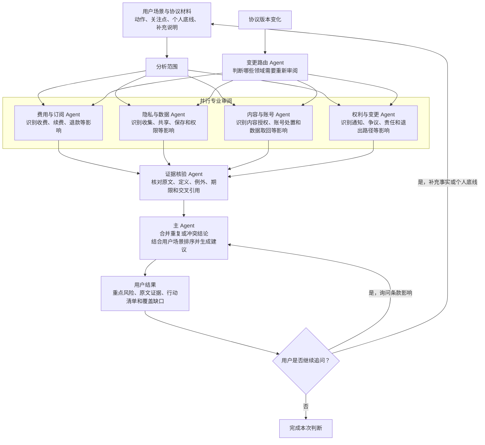

# 协议明镜

协议明镜（Agreement Lens）是一个 Chrome 侧边栏扩展。它会从当前网页发现用户协议、隐私政策和其他相关规则，读取协议来源，结合你的使用场景生成带原文证据的风险提示、行动建议和版本复核结果。

它关注的不是把协议压缩成一段泛泛的摘要，而是把条款转化为：

> 什么时候触发 → 平台可能做什么 → 对你有什么影响 → 你可以采取什么行动 → 原文依据是什么

本项目的完整开发路径面向 Linux + Google Chrome 116+。本地服务默认只监听 `127.0.0.1:4317`。配置外部模型后，协议材料会从本地服务发送到你配置的模型 endpoint；分析结果用于风险识别和行动提示，不构成正式法律意见。

## 快速开始

### 环境要求

- Linux
- Node.js 22.x
- pnpm 10.33.2
- Google Chrome 116 或更高版本
- `bubblewrap`
- 模型服务和对应 API key

### 安装依赖

在仓库根目录执行：

```bash
pnpm install
```

### 配置模型服务

复制环境变量模板：

```bash
cp .env.example .env
```

编辑 `.env`，至少配置与模型服务匹配的 API 地址、密钥、模型名称和 API 格式。详细变量及默认值以 [`.env.example`](.env.example) 为准。

模型适配支持以下配置方向：

- OpenAI-compatible Chat Completions：`MODEL_API_FORMAT=chat`
- OpenAI Responses：`MODEL_API_FORMAT=responses`
- Gemini 原生 SDK/API：`MODEL_API_FORMAT=gemini`，可使用 `GEMINI_BASE_URL` 和 `GEMINI_API_KEY`
- `MODEL_TOOL_MODE=native`：允许 Agent 按需读取协议来源和本地知识材料
- `MODEL_TOOL_MODE=inline`：将已收集材料直接放入模型输入，不使用模型工具调用

侧边栏中的模型选项受当前共享配置约束，所选模型必须同时被当前构建支持，并且能由配置的 endpoint 处理。思考强度、超时、重试次数、工具轮次和按角色覆盖也都通过环境变量配置。

如果使用外部模型服务，请先确认其数据处理政策和网络边界符合你的使用场景。

### 导入本地知识材料

首次运行或修改 `knowledge/` 后，执行：

```bash
pnpm knowledge:import
```

该命令会根据当前 `knowledge/` 目录重新生成只读的 `data/knowledge.db`。`knowledge/` 是可维护的源材料，`data/knowledge.db` 是生成物，不要手工编辑数据库。

`prompts/` 和 `knowledge/` 是可替换、可版本化的输入，不是固定不变的产品功能清单。修改它们后应重新导入知识库，并重启服务，让新的分析任务使用新的材料和提示词版本。维护细节见：

- [`docs/prompt-maintenance.md`](docs/prompt-maintenance.md)
- [`docs/knowledge-maintenance.md`](docs/knowledge-maintenance.md)
- [`docs/knowledge-delivery-format.md`](docs/knowledge-delivery-format.md)

### 构建并启动服务

构建所有 workspace 项目：

```bash
pnpm build
```

启动前台本地服务：

```bash
pnpm server:start
```

服务启动后会在终端输出监听地址和配对码。保持这个终端运行，稍后在扩展首次使用时输入配对码。

### 加载 Chrome 扩展

1. 在 Chrome 地址栏打开 `chrome://extensions`。
2. 开启右上角的“开发者模式”。
3. 点击“加载已解压的扩展程序”。
4. 选择仓库中的 `apps/extension/dist` 目录。
5. 打开任意包含协议或隐私政策链接的网页，点击扩展图标打开侧边栏。
6. 输入本地服务终端显示的配对码。
7. 按提示授权当前站点并扫描页面。

重新构建后，回到 `chrome://extensions` 对扩展执行“重新加载”。如果只修改了前端代码，也需要重新运行 `pnpm build`，因为 Chrome 加载的是 `apps/extension/dist` 中的构建产物。

## 使用流程

一次完整分析大致经过以下步骤：

1. **发现来源**：内容脚本扫描当前页面、Shadow DOM 和可访问的 iframe，识别协议、条款、隐私和订阅等链接。
2. **补齐动态来源**：对单页应用、无显式 `href` 的交互组件和动态加载页面，尝试从页面运行时状态或已加载脚本中解析来源。
3. **准备材料**：用户可以选择或取消自动发现的来源，也可以手动添加文本、URL 或 PDF。
4. **读取和整理**：浏览器优先读取当前已渲染页面；本地服务负责 URL、HTML、PDF 和手动文本的解析、清洗、分段和内容指纹计算。
5. **多视角分析**：分析任务根据用户的动作、关注点、底线和补充说明审阅协议材料，并按配置调用模型工具读取来源或知识材料。
6. **证据核验**：每条告警的引用会回到当前来源快照中核对。无法逐字核对的引用会被标记为待核实，并降低结论可信度。
7. **整合结论**：侧边栏展示重点告警、覆盖缺口、行动清单和总体建议。

分析以后台任务运行，侧边栏会轮询任务状态。任务可以取消；关闭侧边栏不会自动取消已经提交到本地服务的任务。

## Agent 协作流程



各专业 Agent 负责从不同角度发现候选问题；证据核验 Agent 负责确认结论确实由当前协议材料支持；主 Agent 负责去重、排序，并将结果转化为面向用户的建议。协议版本复核时，变更路由 Agent 先判断复核范围；如果变化不明确或影响范围较大，则扩大到更多专业视角。

## 主要能力

### 面向用户场景的风险识别

开始分析前可以填写当前动作、重点关注类别、个人底线和补充情况。常见动作包括：

- 注册或重新同意
- 付费或试用
- 上传内容
- 授权数据

结果按费用、数据、内容、账号和维权等类别展示。每条告警包含：

- 触发条件
- 平台可能采取的行为
- 对用户的实际影响
- 影响程度和置信度
- 可执行的下一步行动
- 当前协议来源中的证据
- 仍需核实的不确定性

### 来源和材料处理

支持的分析材料包括：

- 当前页面发现的 HTML 协议来源
- 动态渲染后的网页内容
- 关联规则链接
- 手动输入的文本
- HTTP/HTTPS 链接
- 文本型 PDF

来源会被规范化并按章节组织。原始来源和解析后的材料会写入 `data/` 下的运行时快照；分析结果保存来源指纹，用于后续版本复核。PDF 当前支持文本提取，不提供 OCR。

关联页面不会无条件无限跟随。Agent 只能读取当前来源注册表中明确列出的引用地址；新读取的关联来源会被登记并与父来源关联。

### 原文证据定位

在侧边栏打开告警详情，可以查看对应的连续原文引用、来源和核验状态。对于可访问的网页来源，扩展还可以打开页面并尝试定位、高亮对应文字。

### 追问和补充材料

分析完成后可以继续询问具体条款对当前场景的影响。也可以添加新的链接、文本或 PDF，触发一份基于合并材料的新分析。

如果追问补充了可能改变结论的事实或用户底线，服务会创建新的分析任务，而不是静默修改已有结果。

### 历史和版本复核

保存后的分析会关联到服务和来源指纹。可以查看最近分析、当前网页历史、模型设置和分析耗时，也可以删除历史记录。

重新复核时会先抓取当前来源并比较内容指纹：

- 正文没有变化时，不会重新调用模型，也不会产生重复版本；
- 检测到变化时，会记录变化章节，并基于当前材料重新分析；
- 变化范围不明确或属于结构性变化时，会扩大复核范围。

## 项目结构

这是一个 pnpm workspace：

```text
apps/
  extension/       Chrome Manifest V3 扩展、侧边栏和网页内容脚本
  server/          Fastify 本地服务、来源解析、任务和持久化
packages/
  agent-core/      分析工作流、模型适配、工具调用和结果整合
  shared/          共享 schema、类型和通用来源处理函数
prompts/           可替换、可版本化的 Agent 提示词
knowledge/         可替换、可导入的本地背景材料
scripts/           服务控制、来源抓取、图标和 E2E 辅助脚本
tests/             评测夹具
data/              运行时数据库、来源快照、日志和测试产物
```

核心数据流是：

```text
Chrome 页面
    ↓
扩展来源发现与浏览器读取
    ↓
Fastify 本地 API
    ↓
来源解析与 SQLite 快照
    ↓
agent-core：专业视角、工具调用、证据核验、结论整合
    ↓
SQLite 分析结果与版本关系
    ↓
Chrome 侧边栏
```

本地服务使用 `data/app.db` 保存配对令牌、分析任务、结果、Agent 会话、轨迹和版本关系；协议原始快照保存在 `data/snapshots/`。这些都是运行时生成物，通常不应提交。

## 常用命令

| 命令 | 用途 |
| --- | --- |
| `pnpm install` | 安装 workspace 依赖 |
| `pnpm build` | 构建共享包、Agent、服务端和 Chrome 扩展 |
| `pnpm typecheck` | 对所有 workspace 执行 TypeScript 类型检查 |
| `pnpm test` | 运行所有单元和安全测试 |
| `pnpm knowledge:import` | 从当前 `knowledge/` 重新生成只读知识库 |
| `pnpm server:start` | 构建并以前台方式启动本地服务 |
| `pnpm server:background` | 构建并在后台启动本地服务 |
| `pnpm server:status` | 查看本地服务是否运行 |
| `pnpm server:stop` | 停止由脚本启动的本地服务 |
| `pnpm dev` | 构建后同时启动服务端 watch 和扩展 Vite 开发服务器 |
| `pnpm evaluate` | 运行默认评测目录中的 JSON 评测夹具 |

扩展构建产物位于 `apps/extension/dist`，服务端编译产物位于 `apps/server/dist`。`dist/`、数据库、快照、日志和测试浏览器 profile 都属于生成物，不是源码安装步骤的一部分。

## 配置索引

常用环境变量如下，完整列表和当前默认值请以 [`.env.example`](.env.example) 为准：

| 变量 | 作用 |
| --- | --- |
| `PORT` | 本地服务端口；扩展默认连接 `4317` |
| `PAIR_CODE` | 首次扩展配对码 |
| `OPENAI_BASE_URL` | OpenAI-compatible 服务地址 |
| `OPENAI_API_KEY` | OpenAI-compatible 服务密钥 |
| `GEMINI_BASE_URL` | Gemini 原生服务地址，可选 |
| `GEMINI_API_KEY` | Gemini 原生服务密钥，可选 |
| `MODEL_NAME` | 默认模型名称 |
| `MODEL_API_FORMAT` | `chat`、`responses` 或 `gemini` |
| `MODEL_TOOL_MODE` | `native` 或 `inline` |
| `MODEL_REASONING_EFFORT` | 模型思考强度 |
| `MODEL_TIMEOUT_MS` | 单次模型请求超时 |
| `MODEL_MAX_TOOL_ROUNDS` | 单次模型会话工具轮次上限 |
| `MODEL_MAX_RETRIES` | 请求或结构化输出失败后的重试次数 |
| `MODEL_MAX_COMPLETION_TOKENS` | 可选的输出 token 上限 |
| `MODEL_VERIFIER_ENABLED` | 是否启用模型证据核验器 |
| `MODEL_FEES`、`MODEL_PRIVACY`、`MODEL_CONTENT`、`MODEL_RIGHTS` | 按领域覆盖模型 |
| `MODEL_VERIFIER`、`MODEL_MAIN`、`MODEL_ROUTER` | 覆盖核验、主整合和版本路由模型 |
| `PROMPT_VERSION` | 写入分析结果的提示词版本标识 |
| `DATA_DIR` | 运行时数据目录 |
| `APP_DB_PATH` | 应用 SQLite 数据库路径 |
| `KNOWLEDGE_DB_PATH` | 只读知识库 SQLite 路径 |
| `EXTENSION_ID` | 可选的扩展来源校验限制 |

配置模型后，模型请求可能包含协议正文、来源目录、工具结果和用户填写的场景信息。API key 只由本地服务读取，不会发送到 Chrome 扩展页面。

## 本地 API 入口

本地服务提供以下能力。除健康检查和配对入口外，接口需要配对后的 Bearer token。

| 方法 | 路径 | 用途 |
| --- | --- | --- |
| `GET` | `/health` | 健康检查 |
| `GET` | `/v1/capabilities` | 查看模型、PDF、知识工具和材料上限等能力 |
| `POST` | `/v1/pair` | 使用配对码建立扩展与本地服务的连接 |
| `POST` | `/v1/analyses` | 创建分析任务 |
| `GET` | `/v1/jobs/:id` | 查询任务状态和 Agent 进度 |
| `POST` | `/v1/jobs/:id/cancel` | 取消任务 |
| `GET` | `/v1/analyses/:id` | 获取完整分析结果 |
| `GET` | `/v1/analyses/:id/trace` | 获取 Agent 交互轨迹 |
| `POST` | `/v1/analyses/:id/follow-up` | 对已有结果追问或补充事实 |
| `GET` | `/v1/analyses/:id/follow-up/progress` | 查询追问进度 |
| `POST` | `/v1/analyses/:id/sources` | 添加来源并创建新的分析任务 |
| `POST` | `/v1/analyses/:id/save` | 保存分析 |
| `DELETE` | `/v1/analyses/:id` | 删除分析及关联快照 |
| `POST` | `/v1/services/:id/recheck` | 检查或重新分析服务的当前版本 |
| `GET` | `/v1/services/:id/versions` | 获取版本列表和变化比较 |

## 安全、隐私和限制

- 本地服务绑定回环地址，不作为公网服务启动。
- 扩展通过配对码换取 Bearer token；令牌会绑定扩展来源并在一段时间后过期。
- URL 来源只允许 HTTP/HTTPS，并拒绝解析到本机或私有网络的地址，以降低 SSRF 风险。
- 浏览器捕获的 HTML 会在服务端再次清理脚本、样式、表单值和内联事件属性。
- 知识库 shell 运行在只读、无网络的 bubblewrap 环境中，只暴露知识材料和知识库快照。
- 动态渲染失败、权限不足、来源超时、PDF 无法提取、只取得摘要、缺少附件或定义不完整时，结果可能出现覆盖缺口；这类缺口会显示在分析结果中。
- 系统不会替用户点击同意、取消、退款、申诉或投诉，也不会自动监控互联网上的所有协议。
- 系统输出不是对条款违法、无效、必然赔偿或必然胜诉的判断。涉及法律结论时，应结合适用法域和具体事实进一步核实。
- 未保存分析会在本地清理任务中保留有限时间；主动保存的分析会持续到用户删除。运行数据库和快照可能包含协议原文，使用共享电脑时应自行管理 `data/` 目录的访问权限。

## 测试与排查

提交或修改代码后，建议执行：

```bash
pnpm typecheck
pnpm test
pnpm build
```

模型交互轨迹默认写入 `data/app.db`，可以通过：

```text
GET /v1/analyses/:analysisId/trace
```

排查模型请求、工具调用、工具返回、重试、结构化输出校验和 Gemini 原生会话。详情见 [`docs/agent-trace-debugging.md`](docs/agent-trace-debugging.md)。

常见问题：

- **扩展显示无法连接服务**：确认 `pnpm server:start` 仍在运行，并检查 `http://127.0.0.1:4317/health`。
- **配对失败**：使用服务启动终端当前输出的配对码；修改 `PAIR_CODE` 后需要重启服务。
- **加载扩展后没有发现来源**：确认已在当前站点授予权限，必要时点击扩展中的重新扫描；登录页或单页应用可能需要先完成页面交互。
- **模型请求失败**：检查 API 地址、密钥、API 格式和模型名称是否匹配，并确认模型服务支持当前配置的工具调用方式。
- **知识库工具不可用**：确认 `/usr/bin/bwrap` 存在，并重新执行 `pnpm knowledge:import` 后重启服务。
- **修改提示词或知识材料没有生效**：重新导入知识库（如适用）、重启本地服务，并创建新的分析任务；旧结果不会自动重写。

更多维护入口：

- [`docs/prompt-maintenance.md`](docs/prompt-maintenance.md)
- [`docs/knowledge-maintenance.md`](docs/knowledge-maintenance.md)
- [`docs/knowledge-delivery-format.md`](docs/knowledge-delivery-format.md)
- [`docs/agent-trace-debugging.md`](docs/agent-trace-debugging.md)
