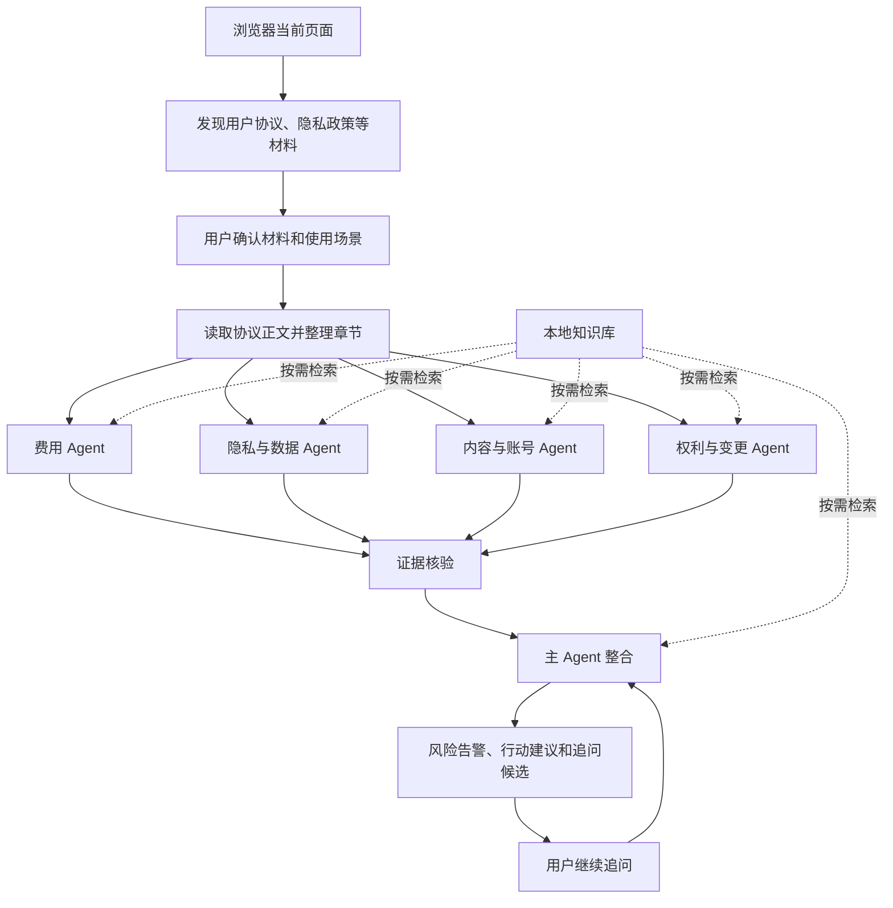

# 协议明镜

“协议明镜”是一个面向课程大作业规模的 Chrome 用户协议解读与预警产品。插件在网页中发现用户协议、隐私政策和付费规则，用户确认当前动作与个人底线后，由四个专业视角并行分析，再进行证据核验和统一整合。

## 产品工作流

协议明镜的核心不是把协议全文直接交给一个模型，而是先由多个专业 Agent 分别审阅，再由证据核验和主 Agent 汇总。



各个 Agent 的职责如下：

- **费用 Agent**：关注价格、试用、自动续费、扣款、退款和取消路径。
- **隐私与数据 Agent**：关注收集范围、敏感信息、第三方共享、跨境处理、保存期限和撤回机制。
- **内容与账号 Agent**：关注用户内容授权、内容删除、账号暂停或终止、数据导出和已购权益。
- **权利与变更 Agent**：关注单方修改、通知、责任限制、争议解决、投诉和救济路径。
- **证据核验**：检查每条告警的引用是否确实存在于当前协议正文中。
- **主 Agent**：去重、综合用户场景和个人底线，生成“可以继续 / 先调整 / 暂缓核实”、行动清单和追问候选。

用户追问时，继续使用主 Agent 的会话；主 Agent 可以再次查询当前协议和本地知识库。版本复核时，会先比较新旧协议原文，再决定是否需要重新调用相关专业 Agent。

如果没有配置模型，系统会切换到本地规则分析器。它适合稳定演示，但判断标准来自代码中的固定规则，不会像模型 Agent 一样完整理解 Prompt。

## 已实现的闭环

- 自动发现中英文协议链接，支持补充 URL、粘贴文本和上传文字型 PDF。
- 费用、数据、内容与账号、权利与变更四个分析角色并行运行。
- 每条告警包含触发条件、平台行为、用户影响、行动建议和可定位原文。
- 主分析器给出“可以继续 / 先调整 / 暂缓核实”，并支持基于当前材料追问。
- HTML、PDF、动态 DOM 回退、最多 8 份一批读取的关联规则、可继续补充至 32 份材料，以及原始/规范化快照。
- 本地 Markdown 知识导入、SQLite FTS5 BM25，以及 bwrap 隔离的只读知识库 shell。
- 已保存服务再次访问时自动复核；正文指纹不变时零模型调用，有变化时按领域路由并记录版本影响。
- OpenAI 兼容模型可选。未配置模型时使用可复现的本地分析器，便于稳定演示。

## 启动

```bash
pnpm install
pnpm knowledge:import
pnpm build
pnpm server:start
```

后端监听 `http://127.0.0.1:4317`，默认配对码是 `246810`。在 Chrome 的“管理扩展程序”中开启开发者模式，选择“加载已解压的扩展程序”，目录为：

```text
apps/extension/dist
```

`pnpm server:start` 会占用当前终端，终端关闭后服务也会停止。需要后台运行时使用：

```bash
pnpm server:background
pnpm server:status
pnpm server:stop
```

点击工具栏中的“协议明镜”，输入配对码，然后允许当前站点权限。若配置模型，将 `.env.example` 中对应变量放入启动环境；不配置也可以完整走通演示闭环。

`MODEL_REASONING_EFFORT` 可设为 `low`、`medium` 或 `high`，默认使用 `low` 以缩短等待时间。
默认单次模型请求超时为 24 小时、最多进行 100 轮工具调用，并允许失败后最多重试 100 次；可通过 `MODEL_TIMEOUT_MS`、`MODEL_MAX_TOOL_ROUNDS` 和 `MODEL_MAX_RETRIES` 调整。每个 Agent 独立统计自己的工具交互轮数和失败重试次数，前端会在分析过程中显示。模型传输格式由 `MODEL_API_FORMAT` 明确选择：`chat` 调用 `/chat/completions`，`responses` 调用原生 `/responses`，`gemini` 通过官方 `@google/genai` SDK 调用 Gemini 原生 API。Gemini 工具调用由 SDK 按原生会话格式维护：保留模型返回的完整 `functionCall` 内容，并在下一轮用 `functionResponse.response.result` 回传实际工具结果，不再由本项目手写 HTTP 协议。当使用 `gemini` 时，可用 `GEMINI_BASE_URL` 和 `GEMINI_API_KEY` 单独指向 Gemini 原生端点。`MODEL_TOOL_MODE=native` 是默认工作方式：Agent 原生调用来源和知识库工具。`inline` 仅用于刻意关闭工具调用的离线材料分析，不会在发生错误时自动启用。模型复核器默认开启，可设置 `MODEL_VERIFIER_ENABLED=false` 关闭。复核器会同时完成证据核验和语义整合：是否属于同一风险由模型结合完整事实、触发条件、平台权利、期限及证据判断，程序不使用关键词或固定规则去重。
重试次数增加会显著增加等待时间和模型费用；100 是容许上限，不代表每次任务都会执行到该次数。
项目默认不额外限制模型输出预算；如模型服务需要显式设置，可通过 `MODEL_MAX_COMPLETION_TOKENS` 配置。协议章节默认完整提供给 Agent；应优先在协议发现和正文解析阶段排除无关材料，而不是通过截断有效协议正文控制上下文。

## 开发与验证

```bash
pnpm typecheck
pnpm test
pnpm build
```

## 修改 Prompt 和知识库

### 修改 Prompt

Prompt 源文件位于 `prompts/`。它们会在模型请求开始时读取，不需要把 Prompt 写进前端。

| 文件 | 影响范围 | 主要用途 |
| --- | --- | --- |
| `common.md` | 所有模型 Agent | 全局分析原则、证据边界、语言和风险校准 |
| `fees.md` | 费用 Agent | 费用、续费、退款和试用 |
| `privacy.md` | 隐私与数据 Agent | 数据收集、共享、跨境和保存期限 |
| `content-account.md` | 内容与账号 Agent | 内容授权、账号处置和数据导出 |
| `rights-changes.md` | 权利与变更 Agent | 单方变更、责任、争议和救济 |
| `verifier.md` | 证据核验 Agent | 检查告警是否有原文依据 |
| `main.md` | 主 Agent 和追问 | 综合告警、生成建议和追问候选 |
| `change-router.md` | 版本路由 Agent | 判断协议变化影响哪些专业领域 |
| `specialist-output.md` | 专业 Agent | 约束 JSON 输出格式，不是风险标准 |

修改建议：

1. 修改所有 Agent 都应遵守的规则，编辑 `prompts/common.md`。
2. 修改某一领域的判断方式，编辑对应的领域 Prompt。
3. 修改最终告警排序、建议或追问候选，编辑 `prompts/main.md`。
4. 修改 JSON 字段或格式时，才编辑 `specialist-output.md`。
5. 修改后更新 `.env` 中的 `PROMPT_VERSION`，便于识别分析结果使用的 Prompt 版本。

例如，要减少“常见条款被判为高危”，应优先在 `common.md` 和对应领域 Prompt 中写清：

- 常见做法不等于高危；
- 必须比较实际影响、异常程度、可逆性和用户控制权；
- 常见、影响有限且退出清楚的安排应降级或不单独告警；
- 只有影响重大且存在明显异常、难以撤回或缺少救济路径时才升级。

更完整的 Prompt 修改说明见 [Prompt 维护说明](docs/prompt-maintenance.md)。

### 修改知识库

知识库源文件位于 `knowledge/*.md`。知识库适合存放：

- 行业常见做法和风险基准；
- 法条、监管材料和案例；
- 正常条款与异常条款的对照样例；
- 不应单独告警的情况；
- 不同法域、服务类型和用户场景的适用边界。

知识库不是当前协议正文的替代品。协议事实必须引用本次读取的协议原文，知识库只提供背景、比较标准和审阅方向。

新增或修改材料后执行：

```bash
pnpm knowledge:import
pnpm server:stop
pnpm server:background
```

`pnpm knowledge:import` 会根据 `knowledge/*.md` 重新生成 `data/knowledge.db`。模型 Agent 会通过 `search_knowledge` 按需查询这些材料；如果 Prompt 没有要求模型查询，模型可能不会主动使用知识库。

需要注意：知识库主要影响配置模型时的 Agent 判断。没有配置模型时，系统使用代码中的确定性规则；若要改变该模式的告警和严重程度，需要修改 `packages/agent-core/src/index.ts` 中的规则。

完整的文件格式、版本管理和常见问题见 [知识库维护说明](docs/knowledge-maintenance.md)。

## 数据位置

- `data/app.db`：任务、分析、服务和版本关系。
- `data/knowledge.db`：离线生成的只读检索库。
- `data/snapshots/`：来源原始响应、规范化章节和内容指纹。

未主动保存的分析按 7 天清理；保存的分析和版本由用户删除时才移除。完整聊天不会长期写入数据库。
